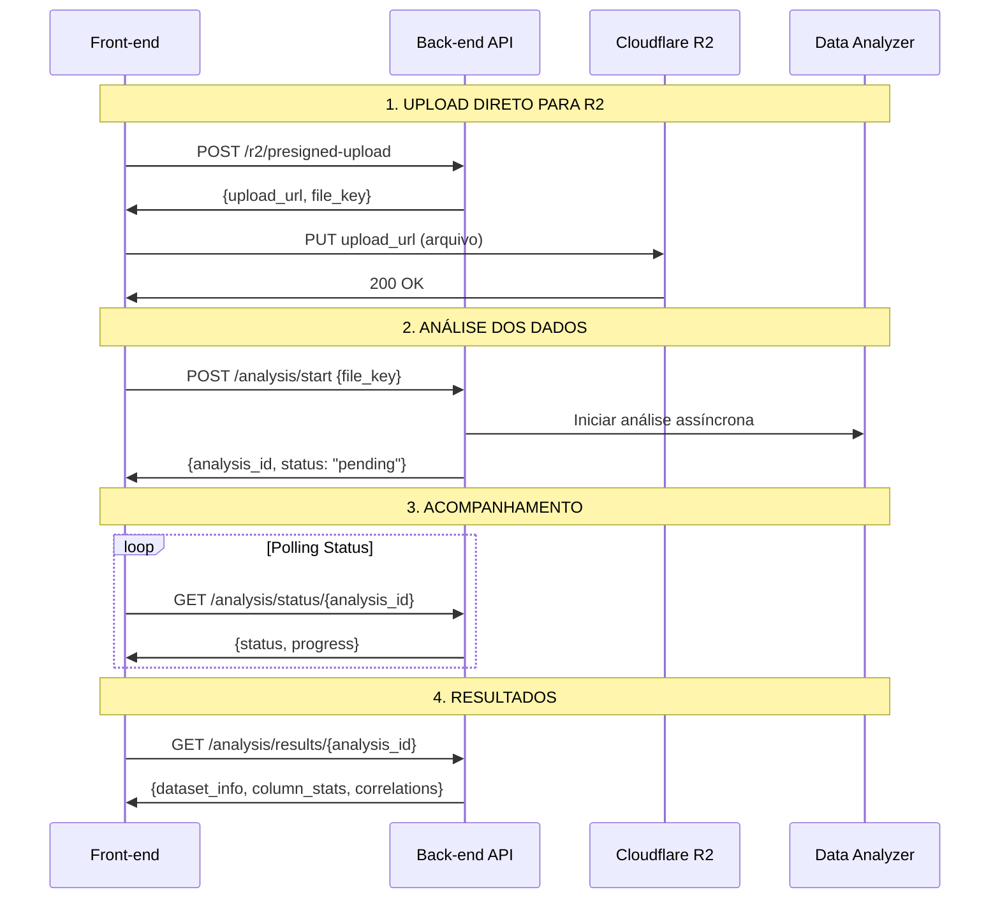

# 🔄 Fluxo Completo: Front-end ↔ Back-end ↔ R2

## Visão Geral

Este documento explica como implementar o fluxo completo de upload e análise de arquivos usando o sistema Cloudflare R2 com URLs pré-assinadas.

## 🏗️ Arquitetura do Fluxo



## 📱 Implementação Front-end

### HTML/JavaScript Vanilla

```html
<!DOCTYPE html>
<html>
<head>
    <title>Upload e Análise de Dados</title>
    <style>
        .container { max-width: 800px; margin: 0 auto; padding: 20px; }
        .upload-area { border: 2px dashed #ccc; padding: 40px; text-align: center; }
        .progress { width: 100%; height: 20px; background: #f0f0f0; border-radius: 10px; }
        .progress-bar { height: 100%; background: #4CAF50; border-radius: 10px; transition: width 0.3s; }
        .results { margin-top: 20px; padding: 15px; background: #f9f9f9; border-radius: 5px; }
    </style>
</head>
<body>
    <div class="container">
        <h1>📊 Análise de Dados EDA</h1>
        
        <div class="upload-area" onclick="document.getElementById('fileInput').click()">
            <input type="file" id="fileInput" accept=".csv,.xlsx,.json" style="display: none;">
            <p>Clique para selecionar um arquivo de dados</p>
            <p><small>Formatos suportados: CSV, Excel, JSON</small></p>
        </div>
        
        <div id="status" style="margin-top: 20px;"></div>
        <div class="progress" id="progressContainer" style="display: none;">
            <div class="progress-bar" id="progressBar"></div>
        </div>
        
        <div id="results" class="results" style="display: none;"></div>
    </div>

    <script>
        const API_BASE = 'http://localhost:8000/api/v1';
        
        // Estado da aplicação
        let currentAnalysisId = null;
        let statusInterval = null;
        
        // Event listeners
        document.getElementById('fileInput').addEventListener('change', handleFileSelect);
        
        async function handleFileSelect(event) {
            const file = event.target.files[0];
            if (!file) return;
            
            updateStatus('📤 Preparando upload...', 'info');
            
            try {
                // 1. Solicitar URL pré-assinada
                const uploadData = await requestPresignedUrl(file);
                
                // 2. Upload direto para R2
                await uploadFileToR2(file, uploadData);
                
                // 3. Iniciar análise
                await startAnalysis(uploadData.file_key);
                
            } catch (error) {
                updateStatus(`❌ Erro: ${error.message}`, 'error');
            }
        }
        
        async function requestPresignedUrl(file) {
            updateStatus('🔗 Solicitando URL de upload...', 'info');
            
            const params = new URLSearchParams({
                filename: file.name,
                content_type: file.type || 'application/octet-stream',
                folder: 'uploads'
            });
            
            const response = await fetch(`${API_BASE}/r2/presigned-upload?${params}`, {
                method: 'POST'
            });
            
            if (!response.ok) {
                throw new Error(`Erro ao solicitar upload: ${response.statusText}`);
            }
            
            return await response.json();
        }
        
        async function uploadFileToR2(file, uploadData) {
            updateStatus('☁️ Enviando arquivo para R2...', 'info');
            
            const response = await fetch(uploadData.upload_url, {
                method: 'PUT',
                body: file,
                headers: {
                    'Content-Type': uploadData.content_type
                }
            });
            
            if (!response.ok) {
                throw new Error(`Erro no upload: ${response.statusText}`);
            }
            
            updateStatus('✅ Arquivo enviado com sucesso!', 'success');
        }
        
        async function startAnalysis(fileKey) {
            updateStatus('🔬 Iniciando análise dos dados...', 'info');
            
            const response = await fetch(`${API_BASE}/analysis/start`, {
                method: 'POST',
                headers: { 'Content-Type': 'application/json' },
                body: JSON.stringify({
                    file_key: fileKey,
                    analysis_type: 'basic_eda'
                })
            });
            
            if (!response.ok) {
                throw new Error(`Erro ao iniciar análise: ${response.statusText}`);
            }
            
            const data = await response.json();
            currentAnalysisId = data.analysis_id;
            
            // Iniciar acompanhamento do status
            showProgress();
            startStatusPolling();
        }
        
        function startStatusPolling() {
            statusInterval = setInterval(async () => {
                try {
                    const status = await checkAnalysisStatus();
                    updateProgress(status.progress);
                    updateStatus(`🔬 ${status.message} (${status.progress.toFixed(1)}%)`, 'info');
                    
                    if (status.status === 'completed') {
                        clearInterval(statusInterval);
                        await loadResults();
                    } else if (status.status === 'error') {
                        clearInterval(statusInterval);
                        updateStatus(`❌ Erro na análise: ${status.message}`, 'error');
                    }
                    
                } catch (error) {
                    clearInterval(statusInterval);
                    updateStatus(`❌ Erro ao verificar status: ${error.message}`, 'error');
                }
            }, 2000); // Check a cada 2 segundos
        }
        
        async function checkAnalysisStatus() {
            const response = await fetch(`${API_BASE}/analysis/status/${currentAnalysisId}`);
            
            if (!response.ok) {
                throw new Error(`Erro ao verificar status: ${response.statusText}`);
            }
            
            return await response.json();
        }
        
        async function loadResults() {
            updateStatus('📊 Carregando resultados...', 'info');
            hideProgress();
            
            const response = await fetch(`${API_BASE}/analysis/results/${currentAnalysisId}`);
            
            if (!response.ok) {
                throw new Error(`Erro ao carregar resultados: ${response.statusText}`);
            }
            
            const results = await response.json();
            displayResults(results);
            updateStatus('🎉 Análise concluída com sucesso!', 'success');
        }
        
        function displayResults(results) {
            const resultsDiv = document.getElementById('results');
            
            const html = `
                <h2>📈 Resultados da Análise</h2>
                
                <h3>📋 Informações do Dataset</h3>
                <ul>
                    <li><strong>Arquivo:</strong> ${results.dataset_info.filename}</li>
                    <li><strong>Dimensões:</strong> ${results.dataset_info.rows.toLocaleString()} linhas × ${results.dataset_info.columns} colunas</li>
                    <li><strong>Tamanho:</strong> ${(results.dataset_info.memory_usage).toFixed(2)} MB</li>
                    <li><strong>Completude:</strong> ${results.summary.completeness_score}%</li>
                </ul>
                
                <h3>📊 Colunas (${results.column_stats.length})</h3>
                <div style="max-height: 300px; overflow-y: auto;">
                    ${results.column_stats.map(col => `
                        <div style="border: 1px solid #ddd; margin: 5px 0; padding: 10px; border-radius: 3px;">
                            <strong>${col.name}</strong> (${col.dtype})
                            <br><small>
                                ${col.non_null_count.toLocaleString()}/${col.count.toLocaleString()} valores 
                                (${(100 - col.null_percentage).toFixed(1)}% completo)
                            </small>
                            ${col.mean !== null ? `<br><small>Média: ${col.mean.toFixed(2)}</small>` : ''}
                            ${col.most_frequent ? `<br><small>Mais frequente: ${col.most_frequent}</small>` : ''}
                        </div>
                    `).join('')}
                </div>
                
                <h3>💡 Recomendações</h3>
                <ul>
                    ${results.summary.recommendations.map(rec => `<li>${rec}</li>`).join('')}
                </ul>
                
                <h3>🔗 Ações</h3>
                <button onclick="downloadReport()">📄 Baixar Relatório Completo</button>
                <button onclick="startNewAnalysis()">🔄 Nova Análise</button>
            `;
            
            resultsDiv.innerHTML = html;
            resultsDiv.style.display = 'block';
        }
        
        function updateStatus(message, type = 'info') {
            const statusDiv = document.getElementById('status');
            statusDiv.innerHTML = `<p style="color: ${getStatusColor(type)}">${message}</p>`;
        }
        
        function getStatusColor(type) {
            switch(type) {
                case 'success': return '#4CAF50';
                case 'error': return '#f44336';
                case 'info': return '#2196F3';
                default: return '#666';
            }
        }
        
        function showProgress() {
            document.getElementById('progressContainer').style.display = 'block';
        }
        
        function hideProgress() {
            document.getElementById('progressContainer').style.display = 'none';
        }
        
        function updateProgress(percent) {
            document.getElementById('progressBar').style.width = `${percent}%`;
        }
        
        function downloadReport() {
            // Implementar download do relatório completo em PDF/Excel
            alert('Função de download será implementada');
        }
        
        function startNewAnalysis() {
            // Reset da interface
            document.getElementById('results').style.display = 'none';
            document.getElementById('fileInput').value = '';
            updateStatus('📁 Selecione um novo arquivo para análise', 'info');
        }
    </script>
</body>
</html>
```

### React/Next.js

```tsx
// components/DataAnalyzer.tsx
import React, { useState, useCallback } from 'react';
import { Upload, BarChart3, FileText, Download } from 'lucide-react';

interface AnalysisState {
  status: 'idle' | 'uploading' | 'analyzing' | 'completed' | 'error';
  progress: number;
  message: string;
  analysisId?: string;
  results?: any;
}

const DataAnalyzer: React.FC = () => {
  const [state, setState] = useState<AnalysisState>({
    status: 'idle',
    progress: 0,
    message: 'Selecione um arquivo para começar'
  });

  const handleFileUpload = useCallback(async (file: File) => {
    setState(prev => ({ ...prev, status: 'uploading', message: 'Preparando upload...' }));

    try {
      // 1. Solicitar URL pré-assinada
      const uploadData = await requestPresignedUrl(file);
      
      // 2. Upload direto para R2
      await uploadToR2(file, uploadData);
      
      // 3. Iniciar análise
      const analysisId = await startAnalysis(uploadData.file_key);
      
      setState(prev => ({ 
        ...prev, 
        status: 'analyzing', 
        analysisId,
        message: 'Iniciando análise...' 
      }));
      
      // 4. Polling do status
      pollAnalysisStatus(analysisId);
      
    } catch (error) {
      setState(prev => ({
        ...prev,
        status: 'error',
        message: `Erro: ${error.message}`
      }));
    }
  }, []);

  const requestPresignedUrl = async (file: File) => {
    const params = new URLSearchParams({
      filename: file.name,
      content_type: file.type || 'application/octet-stream',
      folder: 'uploads'
    });

    const response = await fetch(`/api/r2/presigned-upload?${params}`, {
      method: 'POST'
    });

    if (!response.ok) throw new Error('Erro ao solicitar upload');
    return await response.json();
  };

  const uploadToR2 = async (file: File, uploadData: any) => {
    const response = await fetch(uploadData.upload_url, {
      method: 'PUT',
      body: file,
      headers: { 'Content-Type': uploadData.content_type }
    });

    if (!response.ok) throw new Error('Erro no upload');
  };

  const startAnalysis = async (fileKey: string) => {
    const response = await fetch('/api/analysis/start', {
      method: 'POST',
      headers: { 'Content-Type': 'application/json' },
      body: JSON.stringify({
        file_key: fileKey,
        analysis_type: 'basic_eda'
      })
    });

    if (!response.ok) throw new Error('Erro ao iniciar análise');
    const data = await response.json();
    return data.analysis_id;
  };

  const pollAnalysisStatus = (analysisId: string) => {
    const interval = setInterval(async () => {
      try {
        const response = await fetch(`/api/analysis/status/${analysisId}`);
        const status = await response.json();

        setState(prev => ({
          ...prev,
          progress: status.progress,
          message: status.message
        }));

        if (status.status === 'completed') {
          clearInterval(interval);
          loadResults(analysisId);
        } else if (status.status === 'error') {
          clearInterval(interval);
          setState(prev => ({
            ...prev,
            status: 'error',
            message: `Erro: ${status.message}`
          }));
        }
      } catch (error) {
        clearInterval(interval);
        setState(prev => ({
          ...prev,
          status: 'error',
          message: 'Erro ao verificar status'
        }));
      }
    }, 2000);
  };

  const loadResults = async (analysisId: string) => {
    try {
      const response = await fetch(`/api/analysis/results/${analysisId}`);
      const results = await response.json();

      setState(prev => ({
        ...prev,
        status: 'completed',
        results,
        message: 'Análise concluída!'
      }));
    } catch (error) {
      setState(prev => ({
        ...prev,
        status: 'error',
        message: 'Erro ao carregar resultados'
      }));
    }
  };

  return (
    <div className="max-w-4xl mx-auto p-6">
      <h1 className="text-3xl font-bold mb-6 flex items-center gap-2">
        <BarChart3 className="w-8 h-8" />
        Análise de Dados EDA
      </h1>

      {/* Upload Area */}
      <div className="border-2 border-dashed border-gray-300 rounded-lg p-8 text-center mb-6">
        <input
          type="file"
          accept=".csv,.xlsx,.json"
          onChange={(e) => e.target.files?.[0] && handleFileUpload(e.target.files[0])}
          className="hidden"
          id="file-input"
        />
        <label htmlFor="file-input" className="cursor-pointer">
          <Upload className="w-12 h-12 mx-auto mb-4 text-gray-400" />
          <p className="text-lg font-medium">Clique para selecionar arquivo</p>
          <p className="text-sm text-gray-500">CSV, Excel ou JSON</p>
        </label>
      </div>

      {/* Status */}
      <div className="mb-6">
        <p className={`text-sm ${getStatusColor(state.status)}`}>
          {state.message}
        </p>
        
        {state.status === 'analyzing' && (
          <div className="w-full bg-gray-200 rounded-full h-2 mt-2">
            <div
              className="bg-blue-600 h-2 rounded-full transition-all duration-300"
              style={{ width: `${state.progress}%` }}
            />
          </div>
        )}
      </div>

      {/* Results */}
      {state.status === 'completed' && state.results && (
        <ResultsDisplay results={state.results} />
      )}
    </div>
  );
};

const ResultsDisplay: React.FC<{ results: any }> = ({ results }) => {
  return (
    <div className="bg-gray-50 rounded-lg p-6">
      <h2 className="text-2xl font-bold mb-4">📈 Resultados da Análise</h2>
      
      {/* Dataset Info */}
      <div className="grid grid-cols-2 md:grid-cols-4 gap-4 mb-6">
        <div className="bg-white p-4 rounded border">
          <h3 className="font-semibold text-gray-600">Linhas</h3>
          <p className="text-2xl font-bold">{results.dataset_info.rows.toLocaleString()}</p>
        </div>
        <div className="bg-white p-4 rounded border">
          <h3 className="font-semibold text-gray-600">Colunas</h3>
          <p className="text-2xl font-bold">{results.dataset_info.columns}</p>
        </div>
        <div className="bg-white p-4 rounded border">
          <h3 className="font-semibold text-gray-600">Tamanho</h3>
          <p className="text-2xl font-bold">{results.dataset_info.memory_usage.toFixed(1)} MB</p>
        </div>
        <div className="bg-white p-4 rounded border">
          <h3 className="font-semibold text-gray-600">Completude</h3>
          <p className="text-2xl font-bold">{results.summary.completeness_score}%</p>
        </div>
      </div>

      {/* Columns Overview */}
      <div className="mb-6">
        <h3 className="text-lg font-semibold mb-3">Visão Geral das Colunas</h3>
        <div className="max-h-64 overflow-y-auto space-y-2">
          {results.column_stats.map((col: any, index: number) => (
            <div key={index} className="bg-white p-3 rounded border">
              <div className="flex justify-between items-start">
                <div>
                  <h4 className="font-medium">{col.name}</h4>
                  <p className="text-sm text-gray-600">{col.dtype}</p>
                </div>
                <div className="text-right text-sm">
                  <p>{col.non_null_count.toLocaleString()} / {col.count.toLocaleString()}</p>
                  <p className="text-gray-600">{(100 - col.null_percentage).toFixed(1)}% completo</p>
                </div>
              </div>
            </div>
          ))}
        </div>
      </div>

      {/* Recommendations */}
      <div className="mb-6">
        <h3 className="text-lg font-semibold mb-3">💡 Recomendações</h3>
        <ul className="list-disc pl-5 space-y-1">
          {results.summary.recommendations.map((rec: string, index: number) => (
            <li key={index} className="text-sm">{rec}</li>
          ))}
        </ul>
      </div>

      {/* Actions */}
      <div className="flex gap-3">
        <button className="flex items-center gap-2 bg-blue-600 text-white px-4 py-2 rounded hover:bg-blue-700">
          <Download className="w-4 h-4" />
          Baixar Relatório
        </button>
        <button className="flex items-center gap-2 border border-gray-300 px-4 py-2 rounded hover:bg-gray-50">
          <FileText className="w-4 h-4" />
          Ver Detalhes
        </button>
      </div>
    </div>
  );
};

function getStatusColor(status: string): string {
  switch (status) {
    case 'completed': return 'text-green-600';
    case 'error': return 'text-red-600';
    case 'analyzing': case 'uploading': return 'text-blue-600';
    default: return 'text-gray-600';
  }
}

export default DataAnalyzer;
```

## 🔧 Configuração do Backend

Certifique-se de que as dependências estão instaladas:

```bash
poetry add pandas openpyxl  # Para análise de Excel
```

## 🚀 Vantagens deste Fluxo

### ✅ **Performance**
- Upload direto para R2 (sem passar pelo backend)
- Processamento assíncrono
- Reduz carga no servidor

### ✅ **Escalabilidade**  
- Suporta arquivos grandes
- Múltiplas análises simultâneas
- Cache de resultados

### ✅ **Experiência do Usuário**
- Feedback em tempo real
- Progress tracking
- Interface responsiva

### ✅ **Segurança**
- URLs pré-assinadas com expiração
- Validação de tipos de arquivo
- Controle de acesso por arquivo

## 📊 Tipos de Análise Suportados

- **basic_eda**: Análise exploratória básica
- **advanced_stats**: Estatísticas avançadas
- **data_quality**: Análise de qualidade dos dados
- **correlation_analysis**: Análise de correlações

Este fluxo é ideal para aplicações de análise de dados que precisam processar arquivos de forma eficiente e escalável! 🎯